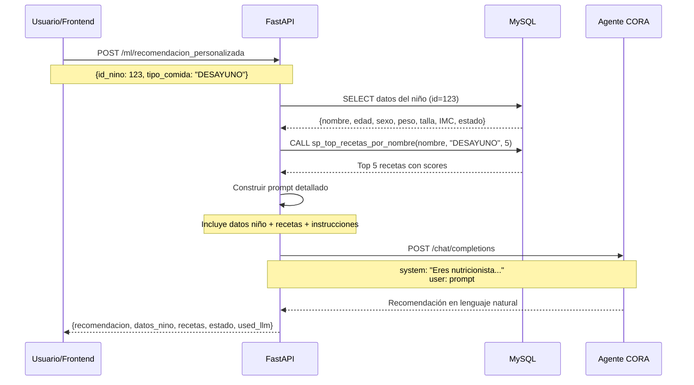

# Design Document

## Overview

Este documento describe el diseño de la migración del sistema de recomendaciones nutricionales desde un enfoque basado en modelos de Machine Learning complejos hacia una arquitectura simplificada que aprovecha:

1. **Agente LLM (CORA)** - Para generar recomendaciones en lenguaje natural
2. **Lógica de negocio en BD** - Procedimientos almacenados y vistas SQL para scoring
3. **Cálculos OMS** - Tablas LMS para BAZ (Body Mass Index-for-age Z-score)

### Objetivos del diseño

- **Simplicidad**: Eliminar la complejidad del entrenamiento y mantenimiento de modelos ML
- **Mantenibilidad**: Centralizar la lógica de scoring en la base de datos
- **Flexibilidad**: Usar el LLM para adaptar recomendaciones al contexto del usuario
- **Confiabilidad**: Mantener cálculos precisos de BAZ usando estándares OMS

### Arquitectura actual vs. nueva

**Actual:**
```
Usuario → API → Modelo ML (RF/NN) → Predicción → Respuesta
                    ↓
              Entrenamiento periódico
              Scripts complejos
              Features engineering
```

**Nueva:**
```
Usuario → API → Procedimiento almacenado → Top recetas
                    ↓
                Agente LLM → Recomendación personalizada
                    ↓
                Respuesta en lenguaje natural
```

## Architecture

### Componentes principales


#### 1. API FastAPI (`modelo/ml-recomendator/app/main.py`)

**Responsabilidades:**
- Exponer endpoints REST para recomendaciones
- Validar requests usando Pydantic models
- Orquestar llamadas a BD y LLM
- Manejar errores y timeouts

**Endpoints a mantener:**
- `GET /health` - Health check (sin verificar modelo ML)
- `POST /ml/predict_baz` - Cálculo de BAZ usando tablas OMS
- `POST /ml/summary` - Resúmenes con LLM
- `POST /ml/chat` - Chat general con LLM
- `POST /ml/recomendacion_personalizada` - **Endpoint principal** para recomendaciones

**Endpoints a eliminar:**
- `POST /ml/predict` - Predicción con modelo ML
- `POST /ml/predict_direct` - Predicción directa con modelo
- `GET /ml/model_info` - Información del modelo
- `POST /ml/analisis_nutricional` - Análisis que depende de modelo ML

#### 2. Cliente LLM (`src/llm/client.py`)

**Responsabilidades:**
- Conectar con el agente CORA vía API OpenAI-compatible
- Enviar prompts y recibir respuestas
- Manejar timeouts y errores de conexión

**Configuración (desde `.env`):**
```
LLM_API_KEY=WFPKqMNpOcHvckGn8eaLMJY7Z-Sokav7
LLM_ID_URL=F-_J9izEFFwgSQuqnxKrTYwGGtSmGgKj
LLM_BASE_URL=https://g44oh7xy2rw5nefpj5hfw4vs.agents.do-ai.run
LLM_MODEL=CORA
LLM_TEMPERATURE=0.2
LLM_MAX_TOKENS=512  # Aumentar para recomendaciones más detalladas
LLM_TIMEOUT=30.0
```

**Clase principal:**
```python
class OpenAICompatClient:
    def chat(self, system_message: str, user_message: str) -> str
```

#### 3. Conector de Base de Datos (`src/utils/db_connector.py`)

**Responsabilidades:**
- Conectar a MySQL usando PyMySQL/SQLAlchemy
- Ejecutar queries y procedimientos almacenados
- Retornar resultados como DataFrames

**Métodos clave:**
- `execute_query(query, params)` - Ejecutar query SQL
- `call_procedure(name, params)` - Llamar procedimiento almacenado
- `from_env()` - Factory desde variables de entorno

**Mejora necesaria:**
El método `execute_query` debe soportar parámetros para queries parametrizadas:
```python
def execute_query(self, query: str, params: tuple = None) -> pd.DataFrame
```


#### 4. Procedimiento Almacenado (`sp_top_recetas_por_nombre`)

**Ubicación:** `BaseDatos/database/procedimientos.sql`

**Parámetros:**
- `p_q_nombre` (VARCHAR(150)) - Nombre del niño (búsqueda fuzzy)
- `p_rc_comida` (VARCHAR(10)) - Tipo de comida: 'DESAYUNO', 'ALMUERZO', 'CENA'
- `p_n_top` (INT) - Número de recetas a retornar (default: 3)

**Lógica:**
1. Buscar niño por nombre usando 3 estrategias:
   - Coincidencia exacta (peso 3)
   - Búsqueda fulltext (peso variable)
   - LIKE pattern (peso 1)
2. Si no encuentra niño → retornar `status='NO_MATCH'`
3. Si encuentra niño → consultar vista `v_recetas_scores_por_nino`
4. Retornar top N recetas ordenadas por `score` DESC

**Columnas retornadas:**
- `status` - 'OK' o 'NO_MATCH'
- `nin_id` - ID del niño
- `nin_nombres` - Nombre del niño
- `en_clasificacion` - Clasificación nutricional (ej: 'NORMAL', 'DESNUTRICION')
- `rc_comida` - Tipo de comida
- `rec_id` - ID de la receta
- `rec_nombre` - Nombre de la receta
- `kcal` - Calorías
- `proteina_g` - Proteínas en gramos
- `hierro_mg` - Hierro en miligramos
- `fibra_g` - Fibra en gramos
- `costo_soles_aprox` - Costo aproximado en soles
- `score` - Puntuación nutricional

#### 5. Vistas SQL

**Vista principal:** `v_recetas_scores_por_nino`

Combina:
- `v_nino_estado_actual` - Estado nutricional actual de cada niño
- `v_recetas_scores_por_estado` - Scoring de recetas por clasificación nutricional

**Lógica de scoring (en `v_recetas_scores_por_estado`):**

```sql
CASE
  WHEN en_clasificacion IN ('DESNUTRICION_SEVERA','DESNUTRICION') THEN
    (proteina_g*2.0 + hierro_mg*1.5 + vitamina_c_mg*0.05 + kcal*0.02)
    - (costo_soles_aprox*0.30)
    
  WHEN en_clasificacion = 'RIESGO' THEN
    (proteina_g*1.5 + hierro_mg*1.0 + kcal*0.015 + fibra_g*0.5)
    - (costo_soles_aprox*0.20)
    
  WHEN en_clasificacion = 'NORMAL' THEN
    (proteina_g*1.0 + fibra_g*0.5 + vitamina_c_mg*0.05 + zinc_mg*0.2)
    - (ABS(kcal-450)*0.01)
    - (costo_soles_aprox*0.15)
    
  WHEN en_clasificacion = 'SOBREPESO' THEN
    (fibra_g*1.0 + proteina_g*0.8)
    - ((kcal-500)*0.02)
    - (grasas_g*0.5)
    - (costo_soles_aprox*0.10)
    
  WHEN en_clasificacion = 'OBESIDAD' THEN
    (fibra_g*1.2 + proteina_g*0.6)
    - ((kcal-450)*0.03)
    - (grasas_g*0.7)
    - (costo_soles_aprox*0.10)
END AS score
```

**Ventajas de esta arquitectura:**
- Lógica de scoring centralizada en BD
- Fácil de ajustar sin reentrenar modelos
- Transparente y auditable
- Rápida ejecución (índices en BD)


## Components and Interfaces

### Flujo de recomendación personalizada



### Interfaces de datos

#### Request: `RecomendacionPersonalizadaRequest`

```python
class RecomendacionPersonalizadaRequest(BaseModel):
    id_nino: int
    tipo_comida: str  # "DESAYUNO" | "ALMUERZO" | "CENA"
    pregunta_usuario: str | None = None  # Opcional
```

#### Response: `RecomendacionPersonalizadaResponse`

```python
class RecomendacionPersonalizadaResponse(BaseModel):
    recomendacion: str  # Texto generado por LLM
    datos_nino: dict[str, Any]  # Información del niño
    recetas_disponibles: list[dict[str, Any]]  # Top recetas
    estado_nutricional: dict[str, Any]  # Diagnóstico y métricas
    used_llm: bool  # True si se usó LLM exitosamente
```

#### Estructura de `datos_nino`

```python
{
    "id": int,
    "nombre": str,  # "Juan Pérez"
    "fecha_nacimiento": str,  # "2020-05-15"
    "sexo": str,  # "M" o "F"
    "peso_kg": float,
    "talla_cm": float,
    "imc": float,
    "edad_meses": int,
    "estado_nutricional": str,  # "NORMAL", "DESNUTRICION", etc.
    "diagnostico": str,
    "entidad": str,  # Nombre de la entidad médica
    "codigo_entidad": str
}
```

#### Estructura de `recetas_disponibles`

```python
[
    {
        "id": int,
        "nombre": str,
        "calorias": float,
        "proteinas": float,
        "carbohidratos": float,
        "grasas": float,
        "fibra": float,
        "hierro": float,
        "costo": float,
        "puntuacion": float  # Score calculado por la vista
    },
    ...
]
```


## Data Models

### Función: `consultar_datos_nino(id_nino: int) -> dict`

**Query SQL:**
```sql
SELECT
    n.nin_id,
    n.nin_nombre,
    n.nin_apellido,
    n.nin_fecha_nacimiento,
    n.nin_sexo,
    n.nin_peso_actual,
    n.nin_talla_actual,
    n.nin_imc_actual,
    n.nin_edad_meses,
    n.nin_estado_nutricional,
    n.nin_diagnostico_nutricional,
    e.ent_nombre,
    e.ent_codigo
FROM ninos n
LEFT JOIN entidades e ON n.ent_id = e.ent_id
WHERE n.nin_id = %s
```

**Transformación:**
- Concatenar `nin_nombre` + `nin_apellido` → `nombre`
- Convertir tipos numéricos apropiadamente
- Manejar valores NULL

### Función: `consultar_recetas_por_nino(id_nino: int, tipo_comida: str) -> list[dict]`

**Pasos:**
1. Obtener nombre del niño: `datos_nino = consultar_datos_nino(id_nino)`
2. Normalizar tipo de comida: `tipo_comida.upper()`
3. Ejecutar procedimiento:
   ```python
   query = "CALL sp_top_recetas_por_nombre(%s, %s, %s)"
   df = db.execute_query(query, (nombre_nino, tipo_comida, 5))
   ```
4. Verificar `status` en primera fila:
   - Si `status == 'NO_MATCH'` → retornar `[]`
   - Si `status == 'OK'` → parsear recetas

**Mapeo de columnas:**
```python
{
    "id": int(row["rec_id"]),
    "nombre": row["rec_nombre"],
    "calorias": float(row["kcal"]),
    "proteinas": float(row["proteina_g"]),
    "carbohidratos": float(row.get("carbohidratos_g", 0)),
    "grasas": float(row.get("grasas_g", 0)),
    "fibra": float(row["fibra_g"]),
    "hierro": float(row["hierro_mg"]),
    "costo": float(row["costo_soles_aprox"]),
    "puntuacion": float(row["score"])
}
```

### Función: `obtener_estado_nutricional(id_nino: int) -> dict`

**Fuente:** Datos ya obtenidos en `consultar_datos_nino`

**Estructura:**
```python
{
    "diagnostico": str,  # nin_diagnostico_nutricional
    "estado_actual": str,  # nin_estado_nutricional
    "imc": float,
    "peso_kg": float,
    "talla_cm": float,
    "edad_meses": int,
    "sexo": str
}
```


## Prompt Engineering

### Función: `crear_prompt_recomendacion(...) -> str`

**Estructura del prompt:**

```
Eres un nutricionista especializado en alimentación infantil. Un padre/madre te consulta sobre recomendaciones nutricionales para su hijo/a.

DATOS DEL NIÑO:
- Nombre: {nombre}
- Edad: {edad_meses} meses
- Sexo: {Masculino/Femenino}
- Peso: {peso_kg} kg
- Talla: {talla_cm} cm
- IMC: {imc}
- Estado nutricional: {diagnostico}
- Diagnóstico: {estado_actual}

RECETAS DISPONIBLES PARA {TIPO_COMIDA}:

1. {receta_nombre}
   - Descripción: {descripcion}
   - Calorías: {calorias} kcal
   - Proteínas: {proteinas}g
   - Carbohidratos: {carbohidratos}g
   - Grasas: {grasas}g
   - Fibra: {fibra}g
   - Hierro: {hierro}mg
   - Puntuación nutricional: {puntuacion}/10

[... hasta 5 recetas]

[SI HAY PREGUNTA ESPECÍFICA]
PREGUNTA ESPECÍFICA DEL USUARIO: {pregunta_usuario}

INSTRUCCIONES:
1. Responde de manera clara, amable y profesional
2. Considera el estado nutricional del niño al hacer recomendaciones
3. Si hay recetas disponibles, sugiere las más apropiadas
4. Incluye porciones adecuadas para la edad
5. Menciona cualquier precaución nutricional importante
6. Si no hay recetas específicas, da recomendaciones generales saludables
7. Mantén un tono positivo y alentador para los padres

RECOMENDACIÓN PERSONALIZADA:
```

**Consideraciones:**
- Limitar a top 5 recetas para no exceder límite de tokens
- Incluir solo información relevante (evitar campos NULL)
- Adaptar instrucciones según si hay pregunta específica o no
- Usar lenguaje claro y accesible para padres

### System Message para el LLM

```python
system_message = """Eres un nutricionista infantil experto. Proporciona recomendaciones seguras, basadas en evidencia científica y apropiadas para la edad del niño. 

IMPORTANTE:
- No emitas diagnósticos médicos
- No reemplaces la consulta con un profesional de salud
- Enfócate en recomendaciones nutricionales prácticas
- Usa lenguaje claro y amigable para padres
- Considera el contexto cultural y económico (Perú, zona rural/urbana)
"""
```

### Parámetros del LLM

```python
temperature = 0.2  # Respuestas consistentes y precisas
max_tokens = 512   # Suficiente para recomendación detallada
timeout = 30.0     # 30 segundos máximo
```


## Error Handling

### Estrategia de manejo de errores

#### 1. Niño no encontrado

```python
if df.empty:
    raise HTTPException(
        status_code=404,
        detail=f"Niño con ID {id_nino} no encontrado"
    )
```

#### 2. Procedimiento retorna NO_MATCH

```python
if df.iloc[0]["status"] == "NO_MATCH":
    return RecomendacionPersonalizadaResponse(
        recomendacion="No se encontró información del niño. Verifica el nombre.",
        datos_nino={},
        recetas_disponibles=[],
        estado_nutricional={},
        used_llm=False
    )
```

#### 3. LLM no disponible

```python
try:
    client = get_llm_client()
    recomendacion = client.chat(system_message=..., user_message=prompt)
    used_llm = True
except Exception as e:
    logger.error(f"Error consultando LLM: {e}")
    recomendacion = (
        "El servicio de recomendaciones personalizadas no está disponible "
        "en este momento. Por favor, consulta con un nutricionista profesional."
    )
    used_llm = False
```

#### 4. Error de base de datos

```python
try:
    db = DatabaseConnector.from_env()
    db.connect()
    # ... operaciones
    db.disconnect()
except Exception as e:
    raise HTTPException(
        status_code=503,
        detail=f"Error de conexión a base de datos: {str(e)}"
    )
```

#### 5. Timeout del LLM

```python
# En OpenAICompatClient
with httpx.Client(timeout=self.timeout) as client:
    try:
        r = client.post(url, headers=headers, json=payload)
        r.raise_for_status()
    except httpx.TimeoutException:
        raise Exception("LLM timeout - intenta nuevamente")
    except httpx.HTTPStatusError as e:
        raise Exception(f"LLM error: {e.response.status_code}")
```

### Logging

```python
import logging

logger = logging.getLogger(__name__)

# En cada función crítica
logger.info(f"Consultando recomendación para niño {id_nino}")
logger.debug(f"Prompt enviado al LLM: {prompt[:200]}...")
logger.error(f"Error en consulta: {str(e)}")
```

### Fallbacks

1. **LLM no disponible** → Retornar mensaje genérico con lista de recetas
2. **Sin recetas** → Recomendaciones generales basadas en estado nutricional
3. **BD sin conexión** → Error 503 (no hay fallback, es crítico)


## Testing Strategy

### Pruebas unitarias

#### 1. Test de consulta de datos del niño

```python
def test_consultar_datos_nino_existente():
    """Verifica que se obtienen datos correctos de un niño existente."""
    datos = consultar_datos_nino(id_nino=1)
    assert datos["id"] == 1
    assert "nombre" in datos
    assert "edad_meses" in datos
    assert datos["sexo"] in ["M", "F"]

def test_consultar_datos_nino_no_existe():
    """Verifica que se lanza excepción si el niño no existe."""
    with pytest.raises(HTTPException) as exc:
        consultar_datos_nino(id_nino=99999)
    assert exc.value.status_code == 404
```

#### 2. Test de consulta de recetas

```python
def test_consultar_recetas_con_resultados():
    """Verifica que se obtienen recetas para un niño válido."""
    recetas = consultar_recetas_por_nino(id_nino=1, tipo_comida="DESAYUNO")
    assert len(recetas) > 0
    assert "nombre" in recetas[0]
    assert "puntuacion" in recetas[0]
    assert recetas[0]["puntuacion"] >= 0

def test_consultar_recetas_sin_match():
    """Verifica que retorna lista vacía si no hay match."""
    recetas = consultar_recetas_por_nino(id_nino=99999, tipo_comida="DESAYUNO")
    assert recetas == []
```

#### 3. Test de construcción de prompt

```python
def test_crear_prompt_con_recetas():
    """Verifica que el prompt incluye todos los elementos necesarios."""
    datos_nino = {"nombre": "Juan", "edad_meses": 24, ...}
    recetas = [{"nombre": "Papilla", "calorias": 200, ...}]
    estado = {"diagnostico": "NORMAL", ...}
    
    prompt = crear_prompt_recomendacion(datos_nino, estado, recetas, "DESAYUNO")
    
    assert "Juan" in prompt
    assert "24 meses" in prompt
    assert "Papilla" in prompt
    assert "DESAYUNO" in prompt
    assert "INSTRUCCIONES" in prompt

def test_crear_prompt_sin_recetas():
    """Verifica que el prompt maneja caso sin recetas."""
    prompt = crear_prompt_recomendacion(datos_nino, estado, [], "DESAYUNO")
    assert "No hay recetas específicas disponibles" in prompt
```

### Pruebas de integración

#### 1. Test del endpoint completo

```python
def test_endpoint_recomendacion_personalizada():
    """Test end-to-end del endpoint principal."""
    response = client.post(
        "/ml/recomendacion_personalizada",
        json={"id_nino": 1, "tipo_comida": "DESAYUNO"}
    )
    assert response.status_code == 200
    data = response.json()
    assert "recomendacion" in data
    assert "datos_nino" in data
    assert "recetas_disponibles" in data
    assert isinstance(data["used_llm"], bool)
```

#### 2. Test con LLM mock

```python
@patch('src.llm.client.get_llm_client')
def test_recomendacion_con_llm_mock(mock_llm):
    """Test con LLM mockeado para verificar flujo."""
    mock_client = Mock()
    mock_client.chat.return_value = "Recomendación de prueba"
    mock_llm.return_value = mock_client
    
    response = client.post(
        "/ml/recomendacion_personalizada",
        json={"id_nino": 1, "tipo_comida": "DESAYUNO"}
    )
    
    assert response.status_code == 200
    assert "Recomendación de prueba" in response.json()["recomendacion"]
    assert response.json()["used_llm"] is True
```

### Pruebas manuales

#### 1. Test con niño real

```bash
curl -X POST http://localhost:8003/ml/recomendacion_personalizada \
  -H "Content-Type: application/json" \
  -d '{
    "id_nino": 1,
    "tipo_comida": "DESAYUNO",
    "pregunta_usuario": "¿Qué le puedo dar que sea rico en hierro?"
  }'
```

#### 2. Test de health check

```bash
curl http://localhost:8003/health
# Debe retornar: {"status": "ok", "lms_loaded": true}
# NO debe incluir "ml_model_loaded"
```

#### 3. Test de procedimiento almacenado directo

```sql
CALL sp_top_recetas_por_nombre('Juan', 'DESAYUNO', 5);
```

### Criterios de aceptación

- ✅ Todos los tests unitarios pasan
- ✅ Endpoint retorna respuesta en < 5 segundos (con LLM)
- ✅ Maneja correctamente casos de error (niño no existe, LLM caído)
- ✅ Prompt incluye toda la información relevante
- ✅ Recomendación del LLM es coherente y útil
- ✅ No hay referencias a modelos ML en logs o respuestas


## Archivos a eliminar

### Directorio `src/models/`
- `base_model.py` - Clase base para modelos ML
- `nn_classifier.py` - Clasificador con redes neuronales
- `direct_classifier.py` - Clasificador directo
- `rf_classifier.py` - Random Forest (si existe)

**Mantener:** Ninguno (todo el directorio se puede eliminar)

### Directorio `src/pipeline/`
- `train_model.py` - Pipeline de entrenamiento
- `train_model_directo.py` - Entrenamiento directo
- Cualquier otro script de entrenamiento

**Mantener:** Ninguno (todo el directorio se puede eliminar)

### Directorio `src/features/`
- `engineering.py` - Feature engineering
- `validators.py` - Validadores de features

**Mantener:**
- `who_calculator.py` - Solo si se usa para cálculo de BAZ (revisar si `main.py` lo necesita)

### Directorio `scripts/`
Eliminar:
- `entrenar_sin_overfitting.sh`
- `rebalancear_y_reentrenar.sh`
- `regenerar_datos.sh`
- `test_bayesian_rf.py`
- `test_clasificacion.py`
- `test_modelo_api.py`
- `test_modelo_directo.py`
- `mejorar_modelo.py`
- `balancear_datos.py`
- `balancear_datos.sql`
- `agregar_variabilidad.py`
- `analizar_overfitting.py`
- `limpiar_features.py`
- `generar_datos_sinteticos.py`
- `generar_graficas.py`
- `generar_graficas_simple.py`

**Mantener:**
- `test_conexion.py` - Test de conexión a BD
- `verificar_datos.py` - Verificación de datos (si no depende de modelos ML)
- `generar_datos_desde_oms.py` - Generación de tablas OMS (útil para BAZ)

### Directorio `models/`
Eliminar todo:
- `*.pkl` - Modelos entrenados
- `*.json` - Métricas de modelos
- `*.csv` - Feature importance
- Subdirectorios: `backup_old/`, `backups/`, `directo/`

### Directorio `data/`
Eliminar:
- `data/processed/` - Datos procesados para ML
- `data/interim/` - Datos intermedios

**Mantener:**
- `data/raw/who/` - Tablas OMS (necesarias para BAZ)
- `data/raw/surveys/` - Datos de encuestas (si se usan para otros propósitos)

### Directorio `configs/`
Eliminar:
- `nn.yaml` - Configuración de redes neuronales
- `rf.yaml` - Configuración de Random Forest

### Directorio `reports/`
Eliminar:
- `reports/figures/` - Gráficas de modelos
- `reports/metrics/` - Métricas de modelos

### Archivos raíz
Eliminar:
- `check_baz.py` - Si solo verifica modelo ML
- `test_recomendaciones.py` - Si solo prueba modelo ML
- `ENTRENAR_AHORA.sh` - Script de entrenamiento (si existe)

### Dependencias en `requirements.txt`

Eliminar:
```
scikit-learn
tensorflow
torch
keras
xgboost
lightgbm
joblib  # Si solo se usa para modelos
```

**Mantener:**
```
fastapi
uvicorn
pydantic
pandas
pymysql
sqlalchemy
httpx
python-dotenv
```


## Cambios en `main.py`

### Sección 1: Imports - Eliminar

```python
# ELIMINAR estos imports
from src.models.direct_classifier import DirectNutritionClassifier, cargar_modelo_directo
from src.features.engineering import ...  # Si existe
```

### Sección 2: Variables globales - Eliminar

```python
# ELIMINAR
ML_MODEL = None

def load_ml_model():
    """Carga el modelo DIRECTO entrenado."""
    # ... toda esta función

load_ml_model()  # Esta llamada también
```

### Sección 3: Health check - Modificar

```python
# ANTES
@app.get("/health")
def health():
    return {
        "status": "ok",
        "ml_model_loaded": ML_MODEL is not None,
        "lms_loaded": LMS is not None
    }

# DESPUÉS
@app.get("/health")
def health():
    llm_available = False
    try:
        if get_llm_client is not None:
            client = get_llm_client()
            llm_available = True
    except:
        pass
    
    return {
        "status": "ok",
        "llm_available": llm_available,
        "lms_loaded": LMS is not None,
        "db_available": DatabaseConnector is not None
    }
```

### Sección 4: Endpoints - Eliminar

```python
# ELIMINAR estos endpoints completos
@app.post("/ml/predict", response_model=PredictMLResponse)
def predict_ml(req: PredictMLRequest) -> PredictMLResponse:
    # ... todo el código

@app.post("/ml/predict_direct", response_model=PredictMLResponse)
def predict_ml_direct(req: PredictMLDirectRequest) -> PredictMLResponse:
    # ... todo el código

@app.get("/ml/model_info")
def model_info():
    # ... todo el código

@app.post("/ml/analisis_nutricional", response_model=AnalisisNutricionalResponse)
def analisis_nutricional(req: AnalisisNutricionalRequest) -> AnalisisNutricionalResponse:
    # ... todo el código (si depende de ML_MODEL)
```

### Sección 5: Función `consultar_recetas_por_nino` - Modificar

```python
# ANTES (línea ~487)
def consultar_recetas_por_nino(id_nino: int, tipo_comida: str) -> list[dict[str, Any]]:
    # ... código que no usa correctamente el procedimiento

# DESPUÉS
def consultar_recetas_por_nino(id_nino: int, tipo_comida: str) -> list[dict[str, Any]]:
    """Consulta las mejores recetas usando sp_top_recetas_por_nombre."""
    if DatabaseConnector is None:
        raise HTTPException(503, "Conector de BD no disponible")
    
    try:
        # 1. Obtener nombre del niño
        datos_nino = consultar_datos_nino(id_nino)
        nombre_nino = datos_nino["nombre"]
        
        # 2. Normalizar tipo de comida
        tipo_comida_norm = tipo_comida.upper()
        if tipo_comida_norm not in ["DESAYUNO", "ALMUERZO", "CENA"]:
            tipo_comida_norm = "DESAYUNO"
        
        # 3. Ejecutar procedimiento almacenado
        db = DatabaseConnector.from_env()
        db.connect()
        
        query = "CALL sp_top_recetas_por_nombre(%s, %s, %s)"
        df = db.execute_query(query, (nombre_nino, tipo_comida_norm, 5))
        
        db.disconnect()
        
        # 4. Verificar resultado
        if df.empty:
            return []
        
        # 5. Verificar status
        if df.iloc[0].get("status") == "NO_MATCH":
            logger.warning(f"No se encontró niño con nombre: {nombre_nino}")
            return []
        
        # 6. Parsear recetas
        recetas = []
        for _, row in df.iterrows():
            recetas.append({
                "id": int(row.get("rec_id", 0)),
                "nombre": row.get("rec_nombre", ""),
                "calorias": float(row.get("kcal", 0)),
                "proteinas": float(row.get("proteina_g", 0)),
                "carbohidratos": float(row.get("carbohidratos_g", 0)),
                "grasas": float(row.get("grasas_g", 0)),
                "fibra": float(row.get("fibra_g", 0)),
                "hierro": float(row.get("hierro_mg", 0)),
                "costo": float(row.get("costo_soles_aprox", 0)),
                "puntuacion": float(row.get("score", 0))
            })
        
        return recetas
        
    except HTTPException:
        raise
    except Exception as e:
        logger.error(f"Error consultando recetas: {str(e)}")
        return []
```

### Sección 6: Función `crear_prompt_recomendacion` - Mejorar

```python
# Actualizar para incluir más detalles nutricionales
def crear_prompt_recomendacion(
    datos_nino: dict[str, Any],
    estado_nutricional: dict[str, Any],
    recetas: list[dict[str, Any]],
    tipo_comida: str,
    pregunta_usuario: str | None = None
) -> str:
    """Crea el prompt para el LLM con toda la información."""
    
    sexo_texto = "Masculino" if datos_nino.get("sexo") == "M" else "Femenino"
    
    prompt = f"""Eres un nutricionista especializado en alimentación infantil. Un padre/madre te consulta sobre recomendaciones nutricionales para su hijo/a.

DATOS DEL NIÑO:
- Nombre: {datos_nino.get('nombre', 'No especificado')}
- Edad: {datos_nino.get('edad_meses', 'No especificada')} meses
- Sexo: {sexo_texto}
- Peso: {datos_nino.get('peso_kg', 'No especificado')} kg
- Talla: {datos_nino.get('talla_cm', 'No especificada')} cm
- IMC: {datos_nino.get('imc', 'No especificado')}
- Estado nutricional: {estado_nutricional.get('diagnostico', 'No especificado')}
- Diagnóstico: {estado_nutricional.get('estado_actual', 'No especificado')}

RECETAS DISPONIBLES PARA {tipo_comida.upper()}:
"""
    
    if recetas:
        for i, receta in enumerate(recetas[:5], 1):
            prompt += f"""
{i}. {receta.get('nombre', 'Sin nombre')}
   - Calorías: {receta.get('calorias', 0):.0f} kcal
   - Proteínas: {receta.get('proteinas', 0):.1f}g
   - Carbohidratos: {receta.get('carbohidratos', 0):.1f}g
   - Grasas: {receta.get('grasas', 0):.1f}g
   - Fibra: {receta.get('fibra', 0):.1f}g
   - Hierro: {receta.get('hierro', 0):.1f}mg
   - Costo aproximado: S/ {receta.get('costo', 0):.2f}
   - Puntuación nutricional: {receta.get('puntuacion', 0):.1f}/10
"""
    else:
        prompt += "\nNo hay recetas específicas disponibles en la base de datos para este tipo de comida.\n"
    
    if pregunta_usuario:
        prompt += f"""

PREGUNTA ESPECÍFICA DEL USUARIO: {pregunta_usuario}

INSTRUCCIONES:
1. Responde de manera clara, amable y profesional a la pregunta específica
2. Considera el estado nutricional del niño al hacer recomendaciones
3. Si hay recetas disponibles, sugiere las más apropiadas
4. Incluye porciones adecuadas para la edad del niño
5. Menciona cualquier precaución nutricional importante
6. Si no hay recetas específicas, da recomendaciones generales saludables
7. Mantén un tono positivo y alentador para los padres
8. No emitas diagnósticos médicos ni reemplaces la consulta profesional

RECOMENDACIÓN PERSONALIZADA:"""
    else:
        prompt += f"""

INSTRUCCIONES:
Proporciona una recomendación nutricional completa para {tipo_comida} considerando:
1. El estado nutricional actual del niño
2. Las mejores recetas disponibles (ordenadas por puntuación)
3. Porciones apropiadas para su edad ({datos_nino.get('edad_meses', 0)} meses)
4. Beneficios nutricionales de las recomendaciones
5. Consejos prácticos para una alimentación saludable
6. Consideraciones económicas (costo de las recetas)

Mantén un tono amable, profesional y alentador. No emitas diagnósticos médicos.

RECOMENDACIÓN PERSONALIZADA:"""
    
    return prompt
```

### Sección 7: Función `consultar_agente_llm` - Mejorar

```python
def consultar_agente_llm(prompt: str) -> str:
    """Consulta al agente LLM (CORA) con el prompt creado."""
    if get_llm_client is None:
        return "El servicio de recomendaciones no está disponible. Consulta con un nutricionista profesional."
    
    try:
        client = get_llm_client()
        
        system_message = """Eres un nutricionista infantil experto especializado en alimentación en Perú. 

IMPORTANTE:
- Proporciona recomendaciones seguras y basadas en evidencia científica
- Adapta las recomendaciones a la edad del niño
- Considera el contexto económico y cultural peruano
- Usa lenguaje claro y amigable para padres
- NO emitas diagnósticos médicos
- NO reemplaces la consulta con un profesional de salud
- Enfócate en recomendaciones nutricionales prácticas y aplicables
- Menciona porciones específicas apropiadas para la edad
- Si el niño tiene desnutrición o sobrepeso, enfatiza la importancia de seguimiento médico"""
        
        respuesta = client.chat(
            system_message=system_message,
            user_message=prompt
        )
        
        if respuesta and len(respuesta.strip()) > 10:
            return respuesta
        else:
            return "No pude generar una recomendación personalizada. Te recomiendo consultar con un nutricionista profesional."
    
    except Exception as e:
        logger.error(f"Error consultando LLM: {str(e)}")
        return "Hubo un problema técnico generando la recomendación. Por favor, intenta nuevamente o consulta con un especialista."
```


## Mejoras en `db_connector.py`

### Modificación necesaria en `execute_query`

```python
# ANTES
def execute_query(self, query: str) -> pd.DataFrame:
    """Ejecuta una query y retorna DataFrame."""
    if self.engine:
        return pd.read_sql(query, self.engine)
    elif self.connection:
        return pd.read_sql(query, self.connection)
    else:
        raise ConnectionError("No hay conexión a la base de datos")

# DESPUÉS
def execute_query(self, query: str, params: tuple = None) -> pd.DataFrame:
    """
    Ejecuta una query y retorna DataFrame.
    
    Args:
        query: Query SQL (puede incluir %s para parámetros)
        params: Tupla de parámetros para la query
    
    Returns:
        DataFrame con resultados
    """
    if self.engine:
        return pd.read_sql(query, self.engine, params=params)
    elif self.connection:
        return pd.read_sql(query, self.connection, params=params)
    else:
        raise ConnectionError("No hay conexión a la base de datos")
```

### Agregar método para procedimientos almacenados (si no existe)

```python
def call_procedure(self, procedure_name: str, params: list = None) -> pd.DataFrame:
    """
    Llama a un procedimiento almacenado.
    
    Args:
        procedure_name: Nombre del procedimiento
        params: Lista de parámetros
    
    Returns:
        DataFrame con resultados
    """
    params = params or []
    
    if not PYMYSQL_AVAILABLE:
        raise ImportError("PyMySQL es requerido para procedimientos almacenados")
    
    # Crear conexión temporal
    conn = pymysql.connect(
        host=self.host,
        port=self.port,
        user=self.user,
        password=self.password,
        database=self.database
    )
    
    try:
        cursor = conn.cursor()
        
        # Construir CALL statement
        placeholders = ", ".join(["%s"] * len(params))
        query = f"CALL {procedure_name}({placeholders})"
        
        cursor.execute(query, params)
        
        # Obtener resultados
        columns = [desc[0] for desc in cursor.description] if cursor.description else []
        rows = cursor.fetchall()
        
        cursor.close()
        conn.close()
        
        # Convertir a DataFrame
        if rows and columns:
            return pd.DataFrame(rows, columns=columns)
        else:
            return pd.DataFrame()
    
    except Exception as e:
        conn.close()
        raise e
```

## Actualización de documentación

### README.md

Actualizar sección de arquitectura:

```markdown
# ML Recomendator

Sistema de recomendaciones nutricionales personalizadas usando:
- **Agente LLM (CORA)** para generar recomendaciones en lenguaje natural
- **Procedimientos almacenados** para scoring de recetas
- **Tablas OMS** para cálculo de BAZ (Body Mass Index-for-age Z-score)

## Arquitectura

```
Usuario → API FastAPI → MySQL (procedimientos + vistas)
                    ↓
                Agente LLM (CORA)
                    ↓
            Recomendación personalizada
```

## Endpoints principales

- `POST /ml/recomendacion_personalizada` - Recomendación personalizada
- `POST /ml/predict_baz` - Cálculo de BAZ
- `POST /ml/chat` - Chat con LLM
- `GET /health` - Health check

## Configuración

Variables de entorno en `.env`:

```env
# Base de datos
DB_HOST=localhost
DB_PORT=3306
DB_USER=root
DB_PASSWORD=root123456
DB_NAME=nutricion

# Agente LLM
LLM_API_KEY=tu_api_key
LLM_BASE_URL=https://tu-agente.run
LLM_MODEL=CORA
LLM_TEMPERATURE=0.2
LLM_MAX_TOKENS=512
```

## Instalación

```bash
pip install -r requirements.txt
```

## Ejecución

```bash
uvicorn app.main:app --host 0.0.0.0 --port 8003 --reload
```

## Ejemplo de uso

```python
import requests

response = requests.post(
    "http://localhost:8003/ml/recomendacion_personalizada",
    json={
        "id_nino": 1,
        "tipo_comida": "DESAYUNO",
        "pregunta_usuario": "¿Qué le puedo dar rico en hierro?"
    }
)

print(response.json()["recomendacion"])
```
```

### Actualizar `docs/ARQUITECTURA_ML.md`

Reescribir completamente para reflejar la nueva arquitectura sin modelos ML.

### Actualizar `docs/API_ML.md`

Eliminar documentación de endpoints de predicción ML, mantener solo:
- `/ml/recomendacion_personalizada`
- `/ml/predict_baz`
- `/ml/summary`
- `/ml/chat`
- `/health`

### Actualizar `control/Nutricion-api/INTEGRACION_ML.md`

Documentar el nuevo flujo de integración sin modelos ML.

## Consideraciones de despliegue

### Variables de entorno en producción

```env
# Producción
LLM_TIMEOUT=60.0  # Mayor timeout en producción
LLM_MAX_TOKENS=1024  # Más tokens para respuestas detalladas
```

### Monitoreo

Agregar logs para:
- Tiempo de respuesta del LLM
- Tasa de éxito/fallo del LLM
- Queries lentas a BD
- Errores de procedimientos almacenados

### Caché (opcional)

Considerar cachear:
- Datos de niños (TTL: 5 minutos)
- Recetas por niño (TTL: 1 hora)
- NO cachear recomendaciones del LLM (deben ser frescas)

